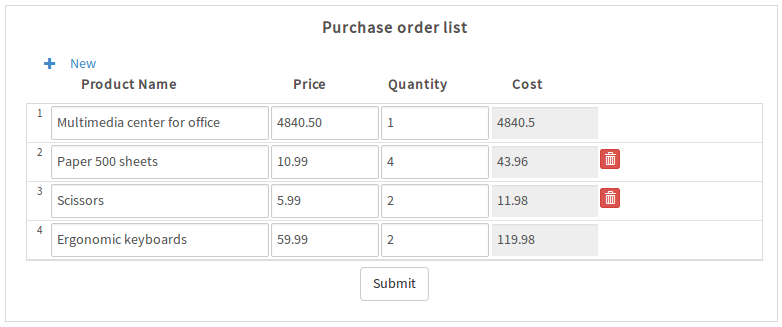

# Use JavaScript to hide "Delete" buttons in grids

This example shows how to hide and show the **Delete** button in a specified grid row, 
based on a changed value in a field in the grid's row. It shows how to check 
whether a value has changed in a particular grid row by looking at the field name 
in the [form.setOnchange()](http://wiki.processmaker.com/3.0/JavaScript_Functions_and_Methods#form.setOnchange) 
event handler function.

**DynaForm:**  [Hide Delete Button in Grid.json](Hide Delete Button in Grid.json) (*right click* on link and select **Save Link As** in the context menu)  
**Author:**    Amos Batto (amos@processmaker.com)  
**Version:**   1.0 (2018-04-26)  
**Tested in:** ProcessMaker 3.2.1 Community in Debian 8.4 (probably will work in all 3.*X* versions)  
**License:**   Public Domain  


First, create a grid which has a field whose value will determine whether
the **Delete** button should be hidden or shown to the user.

In this example, the following grid with the ID "orderList" and the title "Purchase order list"
contains a "cost" field. If the value of the "cost" grid field is over `100`, 
then the **Delete** delete button in the same row should be hidden because the user
is not empowered to delete purchase items which cost over $100.



The ID of the grid and the column number of the "cost" field need to be set in
the JavaScript code. This is used to construct a regular expression that will 
search for the row number of the changed grid field.

If the value which was changed is in the grid, then the `showHideDeleteButtonsInGrid()`
function is called to check whether the "cost" field is over `100` in 
the row that was changed. 

In order to hide or show the **Delete** button, this function uses a jQuery
[selector](https://api.jquery.com/category/selectors/) to find all 
the `div`s with the `pmdynaform-grid-removerow-responsive` class,
which hold the **Delete** button. Then, it uses the [.eq()](https://api.jquery.com/eq/) 
function to select the one in the row number. 
`1` is subtracted from the row number, because arrays start 
counting from zero, but grid rows start counting from one. 

```javascript
$("div.pmdynaform-grid-removerow-responsive").eq(i-1).find("button").hide();  
```
Notice how the [parseFloat()](https://developer.mozilla.org/en-US/docs/Web/JavaScript/Reference/Global_Objects/parseFloat) 
function is used to convert the value in the "cost" grid field to a floating point number
so it can used in a mathematical comparison. If it is possible that the user
has entered non numerical input, it is always a good idea to use 
[isNaN()](https://developer.mozilla.org/en-US/docs/Web/JavaScript/Reference/Global_Objects/isNaN) to 
check that the string input by the user was converted to a valid number.

Here is the complete JavaScript of the form:

```javascript
//set to the ID of the grid:
var gridId = "orderList";  
//set to the column number of field to check whether to show/hide the delete button:
var fieldColNo = 4;

//regular expression to get grid row number in form.setOnchange():
var gridRE = new RegExp('^\\['+gridId+'\\]\\[(\\d+)\\]'); 

//function that hides the "Delete" button in the grid's rowNumber 
//if the "cost" field is over 100. Otherwise, it shows the button.
//If the rowNumber is set to 0, then all the rows in the grid will be checked  
function showHideDeleteButtonsInGrid(rowNumber) {
  var oGrid = $("#"+gridId);
  
  if (rowNumber < 1) {
    var nRows = oGrid.getNumberRows();
    
    for (var i = 1; i <= nRows; i++) {
      var cost = parseFloat( oGrid.getValue(i, fieldColNo) );
     
      if (!isNaN(cost) && cost >= 100) {
        $("div.pmdynaform-grid-removerow-responsive").eq(i-1).find("button").hide();    
      }
      else {
        $("div.pmdynaform-grid-removerow-responsive").eq(i-1).find("button").show();    
      }    
    }
  }
  else {
    var cost = parseFloat( oGrid.getValue(rowNumber, fieldColNo) );
    
    if (!isNaN(cost) && cost >= 100) {
      $("div.pmdynaform-grid-removerow-responsive").eq(rowNumber-1).find("button").hide();    
    }
    else {
      $("div.pmdynaform-grid-removerow-responsive").eq(rowNumber-1).find("button").show();    
    } 
  }  
}

//execute when dynaform loads to hide/show Delete buttons in
//every row in the grid:
showHideDeleteButtonsInGrid(0);

//change event handler for all fields in Dynaform, which only looks
//for changes in the grid:
$( "#"+$("form").prop("id") ).setOnchange( function(fieldName, newVal, oldVal) {
  var oGrid = $("#"+gridId);
  var aMatch = fieldName.match(gridRE);

  if (aMatch !== null) {
    var rowNo = parseInt(aMatch[1]);
    showHideDeleteButtonsInGrid(rowNo);
  }
})
```
