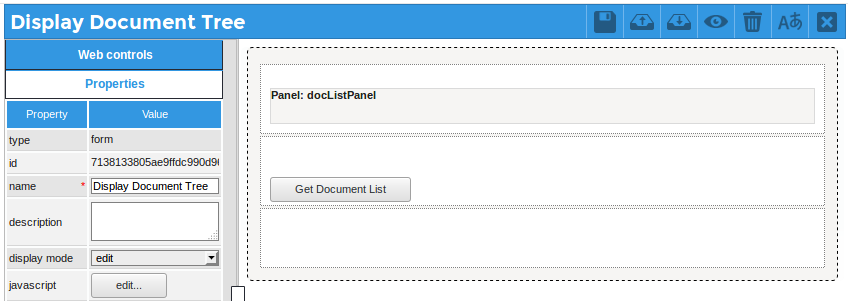
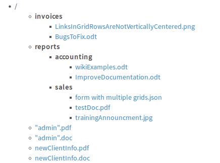

# Use REST to display a document tree

This example shows how to call a REST endpoint from within a DynaForm by clicking on 
a button and calling jQuery's [$.ajax()](http://api.jquery.com/jQuery.ajax/) function. 
The custom endpoints [GET extrarest/documents/{fld_uid}/folders](https://github.com/amosbatto/pmcommunity/tree/master/extraRest#get-documents-in-folder-get-extrarestdocumentsfdr_uidcontents) 
and [GET extrarest/documents/{fld_uid}/contents](https://github.com/amosbatto/pmcommunity/tree/master/extraRest#get-documents-in-folder-get-extrarestdocumentsfdr_uidcontents) 
are called to display the directory tree of documents inside a panel, 
which is similar to what is seen by going to **Home > Documents** in the 
ProcessMaker interface.

**DynaForm:**  [Display Document Tree.json](Display%20Document%20Tree.json) (*right click* on link and select **Save Link As** in the context menu)  
**Author:**    Amos Batto (amos@processmaker.com)  
**Version:**   1.0 (2018-05-02)  
**Tested in:** ProcessMaker 3.2.1 Community in Debian 8.4 with Firefox 51  
**License:**   Public Domain  

First, install the [extraRest](https://github.com/amosbatto/pmcommunity/tree/master/extraRest) plugin and enable it. Then, add following 
"Display Document Tree" Dynaform to a process:



This DynaForm consists of a panel with the ID "docListPanel" and a button
with the ID "docListBtn" and the label "Get Document List".

Then add the following JavaScript to the DynaForm:
```javascript
var host = PMDynaform.getHostName();              // get the hostname
var ws = PMDynaform.getWorkspaceName();           // get the current workspace
var token = PMDynaform.getAccessToken();          // get the access Token
var listTree = '';

function getSubfolders(folderId, indent, startingFolder) {
    if (folderId == "root") {
        listTree = "<ul><li>\/</li>\n";
        indent += '  ';
    }
    else if (startingFolder == true) {
        listTree = '';
    }
  
    $.ajax({
        url: host+"/api/1.0/"+ws+"/extrarest/documents/"+folderId+"/folders",                
        type: "GET",
        async: false, 
        beforeSend: function(xhr){
          xhr.setRequestHeader('Authorization', 'Bearer '+token);
        },       
        success: function(oFolders) {
          console.log(oFolders);
          listTree += "<ul>\n";
          
          for (var idx = 0; idx < oFolders.folders.length; idx++) {
            console.log(idx + ":"+ oFolders.folders[idx].FOLDER_NAME);
            
            listTree += indent + "<li><strong>" + oFolders.folders[idx].FOLDER_NAME + "</strong></li>\n";
            getSubfolders(oFolders.folders[idx].FOLDER_UID, indent+"  ", false);
          }
          
          getFolderContents(folderId, indent);
          listTree += "</ul>\n";
          
          if (folderId == "root") {
            listTree += "</ul>\n";
          }
          
          if (folderId == "root" || startingFolder == true) {
            $("#docListPanel").find("div.panel-body").html(listTree);
          }
        },
        contentType: "application/json; charset=utf-8",
        error:function(error) {
          alert(error);
          console.log(error);
        }
    });
}

function getFolderContents(folderId, indent) {
  $.ajax({
        url: host+"/api/1.0/"+ws+"/extrarest/documents/"+folderId+"/contents?limit=50",                 
        type: "GET",
        async: false,
        beforeSend: function(xhr){
          xhr.setRequestHeader('Authorization', 'Bearer '+token);
        },       
        success: function(oDocList) {
          console.log(oDocList);                        
          for (i = 0; i < oDocList.documents.length; i++) { 
            if (oDocList.documents[i].APP_DOC_TYPE == 'OUTPUT') {  
              listTree += indent + '<li><a href="' + oDocList.documents[i].DOWNLOAD_LINK +
              	'">' + oDocList.documents[i].APP_DOC_FILENAME + 
                oDocList.documents[i].DOWNLOAD_LABEL + "</a></li>\n";
              
              if (oDocList.documents[i].DOWNLOAD_LINK1 != '') {
              	listTree += indent + '<li><a href="' + oDocList.documents[i].DOWNLOAD_LINK1 +
              		'">' + oDocList.documents[i].APP_DOC_FILENAME + 
                	oDocList.documents[i].DOWNLOAD_LABEL1 + "</a></li>\n";
              }
            }
            else { // if an Input Document or attached file:
              listTree += indent + '<li><a href="' + oDocList.documents[i].DOWNLOAD_LINK +
              	'">' + oDocList.documents[i].APP_DOC_FILENAME + "</a></li>\n";
            }
          }  
        },
        contentType: "application/json; charset=utf-8",
        error:function(error) {
          alert(error);
          console.log(error);
        }
    });
}

function getDocList() {
  getSubfolders("root", "");  
}

$("#docListBtn").find('button').click(getDocList);

```
When the "docListBtn" button is clicked, it will call the `getDocList()` function,
which in turn calls the `getSubfolders()` function. This function uses
`$.ajax()` to asynchronously call `GET extrarest/documents/{fld_uid}/folders` to
retrieve a list of the subfolders in the root "/" folder. It also calls the
`getFolderContents()` function to print out a list of documents in the folder. 
If it finds any subfolders it then recursively calls `getSubFolders()` to
also print out their contents as well. 

When it finishes recursively calling `getSubfolders()`, the above code will 
display a directory tree of the documents in the "docListPanel":



This code works when there are a small number of documents stored in 
the ProcessMaker workspace, but it may have trouble when dealing with 
a large number of documents. Asynchronous REST calls are inconvenient, 
because they block the user from accessing the browser while waiting for the 
REST calls to terminate. However, they are necessary
in this situation, because the subfolders and their contents have to be printed out 
in the correct order. To deal with this problem, a maximum of documents
are displayed per folder with the query string `&limit=50`. 
If dealing with a large number of documents, it is
probably a good idea to not print out the documents in each folder. Instead, make
the folder names links that will display the folder's documents in a separate panel
to the right. It also may be necessary to increase the 
[max_execution_time](http://php.net/manual/en/info.configuration.php#ini.max-execution-time) 
setting in the ProcessMaker server's **php.ini** file, so that calling the REST endpoints
won't time out. 


