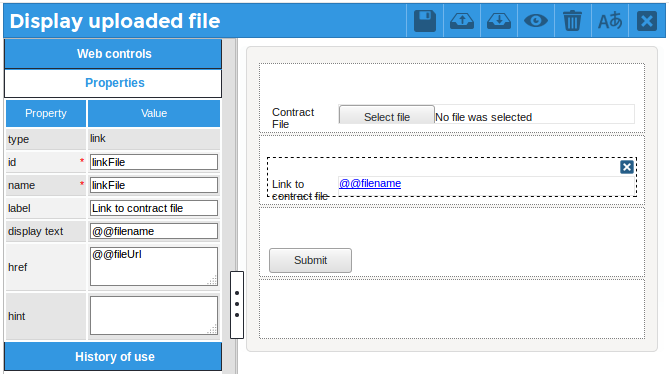
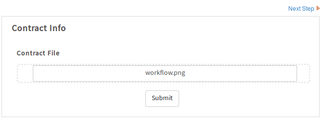
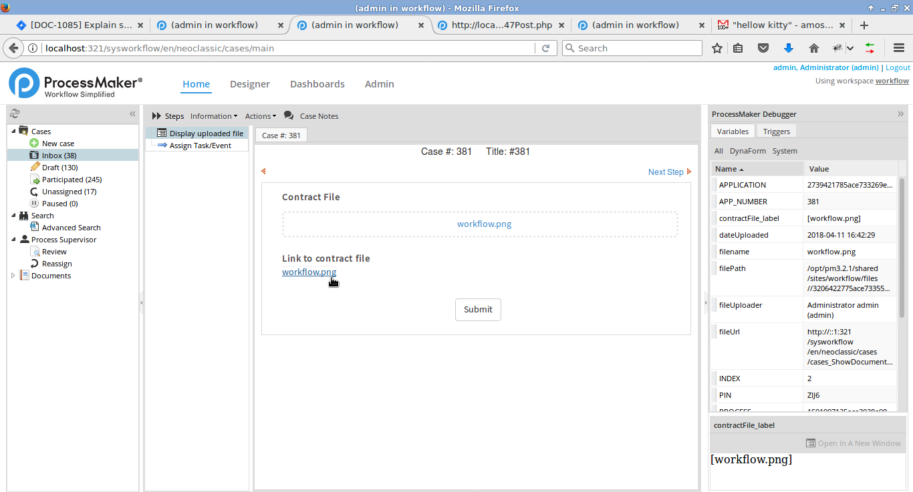

## Displaying a link to an uploaded file from a Web Entry 

Process: [Web_Entry_with_uploaded_file-1.pmx](Web_Entry_with_uploaded_file-1.pmx) (*right click* on link and select **Save Link As**)  
Author: Amos Batto (amos@processmaker.com)  
Created: 2018-04-09 (version 1)  
Tested in: PM 3.2.1 Community in Debian 8.4 with PHP 5.6.20   
License: Public domain  

Please leave feedback and comments about this process at:  
https://forum.processmaker.com/viewtopic.php?f=41&t=730430&p=814005#p814005

MultipleFile fields (which are called "fileUpload" in the Dynaform designer) don't work in Web Entry in ProcessMaker 3.2.1 and earlier, so File fields should be used instead. If needing to upload multiple files in a Web Entry, it is recommended to place File files inside a grid. 

Unfortunately, File fields in Web Entry forms behave differently from normal Dynaforms when they are submitted. When the Web Entry form is submitted, ProcessMaker does not create the **@@_file-variable_** variable with the ID of the uploaded file in a JSON array, like it normally would when submitting a Dynaform. Instead, the Web Entry only creates a **@@*file-variable*_label** variable, such as `@@contractFile_label` which holds the filename of the uploaded file, such as `"[march-contract.doc]"`. Notice that filename isn't enclosed in quotation marks so it is bad JSON and can't be properly decoded with PHP's `json_decode()` or similar functions.

To get around these problems, the `APP_DOCUMENT` table in the database needs to be queried to lookup the record of the uploaded file. With the information from the `APP_DOCUMENT` table, a URL to download the uploaded file can be constructed. This URL can be displayed in a Link field inside a Dynaform or placed inside the template of an Output Document or email. In version 3.1 and later, the `APP_DOCUMENT.APP_DOC_FILENAME` field was added to the database to hold the filenames of files in Processmaker cases, but in early versions the filenames have to be looked up in the `CONTENT.CON_VALUE` field in the database. This example shows how to look up the filename in the CONTENT table, since it should work in all ProcessMaker versions.

The following trigger is used to query the database for a file uploaded to a File field in a Web Entry form whose variable, ID and name are all "contractFile". To simplify the trigger code, it is recommended to use the same name for the variable, ID and name of a File field.  
```php
if (!empty(@@contractFile_label) and @@contractFile_label != '[]') {
   $caseId = @@APPLICATION;
   $sql = "SELECT AD.*, C.CON_VALUE AS FILENAME 
      FROM APP_DOCUMENT AD, CONTENT C 
      WHERE AD.APP_UID='$caseId' AND AD.APP_DOC_FIELDNAME='contractFile'
      AND AD.APP_DOC_STATUS='ACTIVE' AND AD.APP_DOC_UID=C.CON_ID AND
      C.CON_CATEGORY='APP_DOC_FILENAME' ORDER BY AD.APP_DOC_INDEX DESC";
   $aFiles = executeQuery($sql);
    
   if (count($aFiles) == 0) {
      throw new Exception("File not found for case '$caseId' in APP_DOCUMENT table.");
   }    
   @@filename = $aFiles[1]['FILENAME'];
   @@fileUrl = "http://{$_SERVER['SERVER_ADDR']}:{$_SERVER['SERVER_PORT']}/sys" . @@SYS_SYS .
      "/en/neoclassic/cases/cases_ShowDocument?a=".$aFiles[1]['APP_DOC_UID'].
      "&v=".$aFiles[1]['DOC_VERSION'];
    
   //other information about the uploaded file:
   $aUser = userInfo($aFiles[1]['USR_UID']);
   @@fileUploader = $aUser['firstname'].' '.$aUser['lastname'].' ('.$aUser['username'].')';
   @@dateUploaded = $aFiles[1]['APP_DOC_CREATE_DATE'];
    
   //path where file is stored on server
   $g = new G();
   @@filePath = PATH_DOCUMENT. $g->getPathFromUID($aFile["APP_UID"]) .PATH_SEP. 
       $aFiles[1]['APP_DOC_UID'] .'_'. $aFile['DOC_VERSION'] .'.'. 
       pathinfo(@@filename, PATHINFO_EXTENSION);
} 
```
This trigger creates two case variables `@@filename` and `@@fileUrl`, which can be used to display the name of the file and its URL in a subsequent Link field.

If extra information is needed about the uploaded file, this trigger also contains code to look up the full name of the user who was assigned to the Web Entry, the time when the file was submitted and the path where the uploaded file is stored on the ProcessMaker server. 

This trigger is set to fire *before* the following DynaForm which contains a Link field:



The Link field's **display text** property is set to `@@filename` to display the filename of the uploaded file and its **href** property is set to `@@fileUrl` to provide the address to download the file.

When the following Web Entry form holding the "contractFile" field is filled out by an external user:



The `@@contractFile_label` case variable will be set to `"[workflow.png]"` after the form is submitted. Then, when the case is opened inside ProcessMaker, the following Dynaform is displayed which contains both the "contractFile" File field and a Link field to download the file. It is recommended to use a File field if wishing to allow the user to change the file or a Link field if the file should not be changed by the user. 



